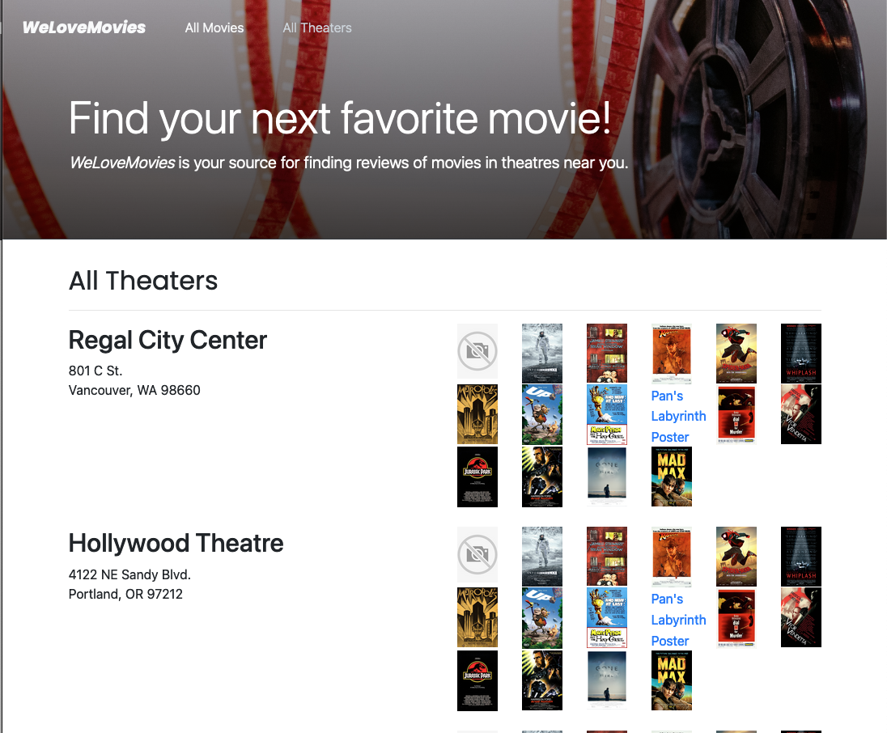

# WeLoveMovies project description

Deployed version of this application: https://welovemoviesproject-frontend.onrender.com

For this project I've set up a database and built an API using RESTful principles. Specific routes allow users to gain access to data about movies, theaters, and reviews.

## Technologies used
Javascript, Node.js, Express, Knex, PostgreSQL

### Desktop view

